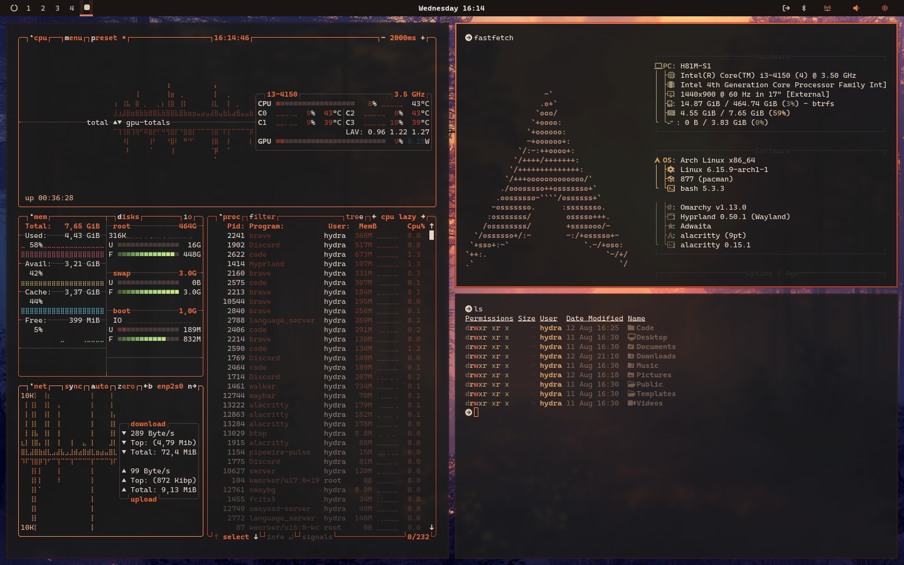

# Ember n Ash Theme for Zed

A warm, smoky aesthetic for [Zed](https://zed.dev) — deep charcoals and ashy grays kissed with soft ember light.

> **Credits & Attribution:**  
> This theme is a port for Zed created and maintained by **bashln**, based on the original [Ember n Ash](https://github.com/Hydradevx/omarchy-ember-n-ash-theme) color palette designed by [Hydradevx](https://github.com/Hydradevx).



---

## 🎨 Themes Included

1. **Ember n Ash** (Solid / Opaque) — Full contrast with deep charcoal background (`#1a1a1a`).
2. **Ember n Ash (Soft Blur)** — Subtle frosted smoky backdrop (~88% opacity) designed for blurred window compositing.
3. **Ember n Ash (Deep Blur)** — Pronounced glass / frosted look (~72% opacity) while retaining high text readability.

---

## 🧬 Color DNA

### Core Shades
| Purpose     | Hex       | Name                |
|-------------|-----------|---------------------|
| Background  | `#1a1a1a` | Deep Ash Charcoal   |
| Foreground  | `#e5d6c6` | Warm Ash Beige      |
| Secondary   | `#2a2a2a` | Smoked Iron         |
| Surface     | `#241e1b` | Warm Ash            |
| Highlights  | `#3a2e2a` | Highlighted Ash     |
| Comments    | `#5c4c46` | Muted Ash / Comment |

### Accents
| Role        | Hex       | Description         |
|-------------|-----------|---------------------|
| Primary     | `#ff884d` | Soft Ember Orange   |
| Secondary   | `#d9a066` | Ashy Gold           |
| Success     | `#9e8f70` | Muted Moss          |
| Warning     | `#e3b97f` | Burnished Amber     |
| Error       | `#d45d4c` | Smoldering Coal     |
| Info        | `#a98274` | Dusty Clay          |
| Yellow Tip  | `#ffcc66` | Bright Fire Yellow  |

### Terminal Palette
| Color       | Normal    | Bright    |
|-------------|-----------|-----------|
| Black       | `#1a1a1a` | `#2a2a2a` |
| Red         | `#d45d4c` | `#e87461` |
| Green       | `#9e8f70` | `#b39c7c` |
| Yellow      | `#d9a066` | `#e3b97f` |
| Blue        | `#6c5b4c` | `#7f6b5d` |
| Magenta     | `#b57276` | `#c6898c` |
| Cyan        | `#a98274` | `#ba9486` |
| White       | `#d1c0b0` | `#f2e6d8` |

---

## 🚀 Installation

### Option 1: Install as a Dev Extension (Local)
1. Open Zed.
2. Open the Command Palette (`Ctrl+Shift+P` / `Cmd+Shift+P`).
3. Run `zed: install dev extension`.
4. Select this repository folder.

### Option 2: Import via Zed Theme Builder
Import [`themes/ember-n-ash.json`](./themes/ember-n-ash.json) into the [Zed Theme Builder](https://theme-builder.zed.dev).

---

## ✨ Enabling Blur in Zed

To enable background blur for the translucent variants, add the following to your Zed `settings.json`:

```json
{
  "theme": "Ember n Ash (Soft Blur)",
  "window_background_appearance": "blurred"
}
```

---

## 📄 License

Original palette by [Hydradevx](https://github.com/Hydradevx/omarchy-ember-n-ash-theme). Ported for Zed by **bashln**.
